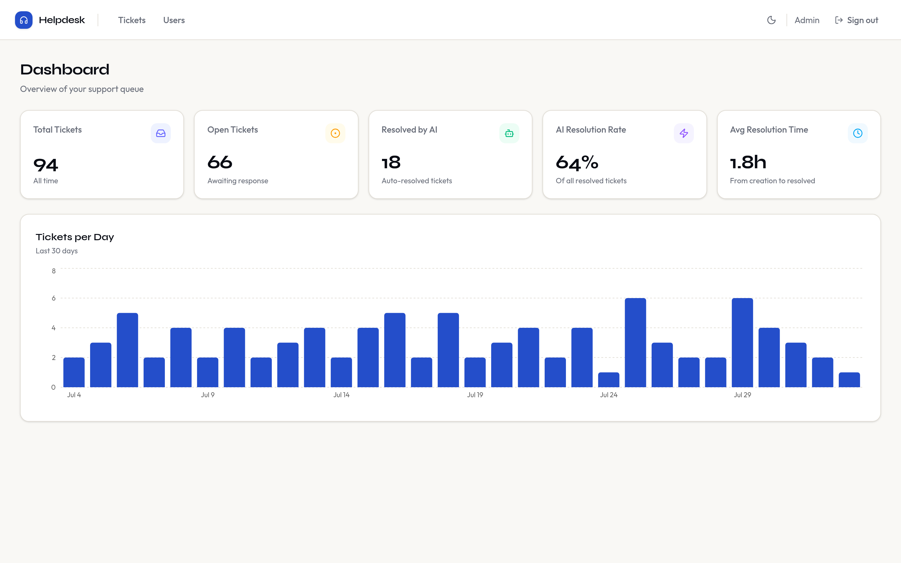
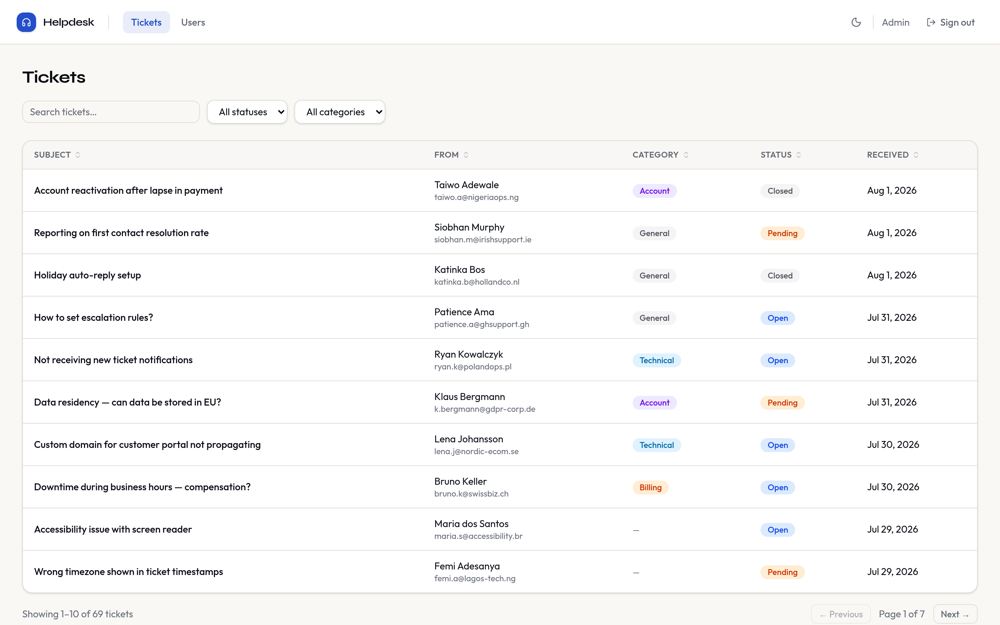
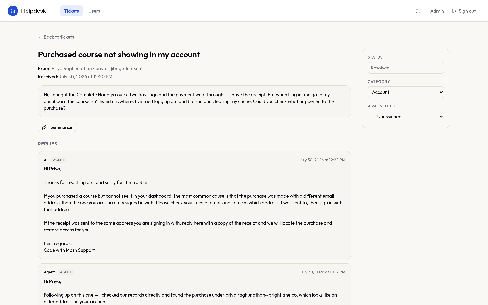
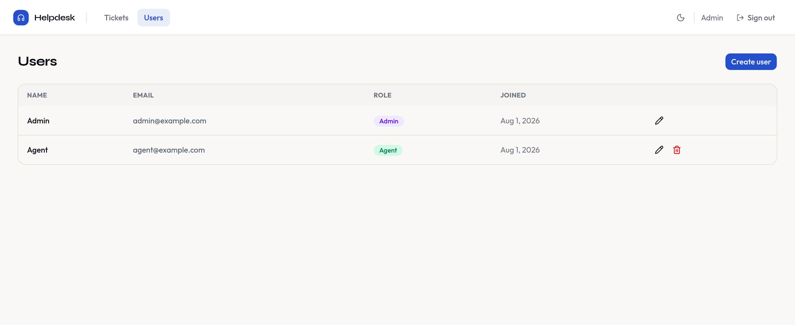
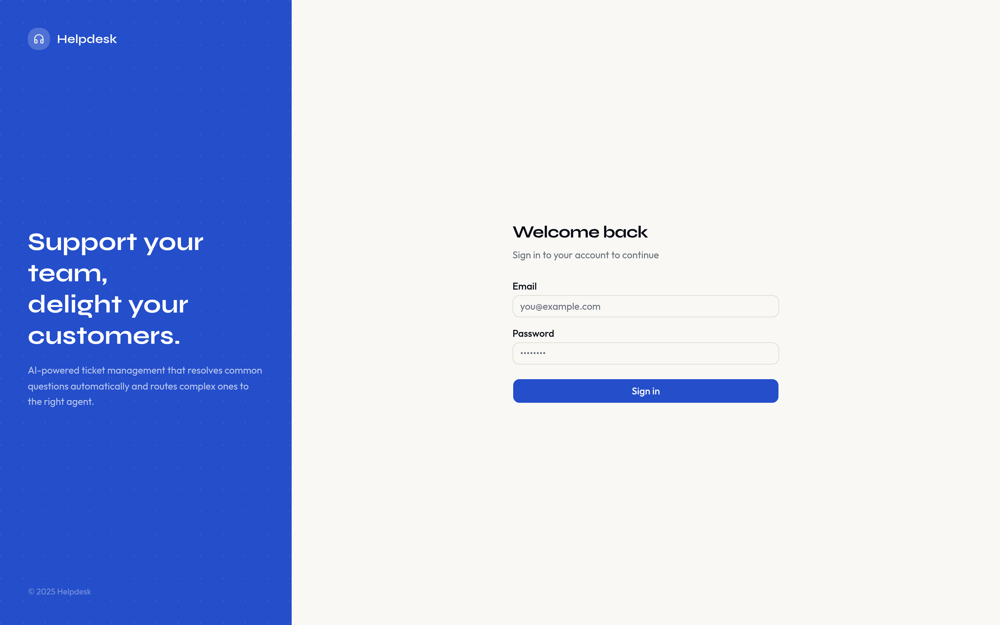
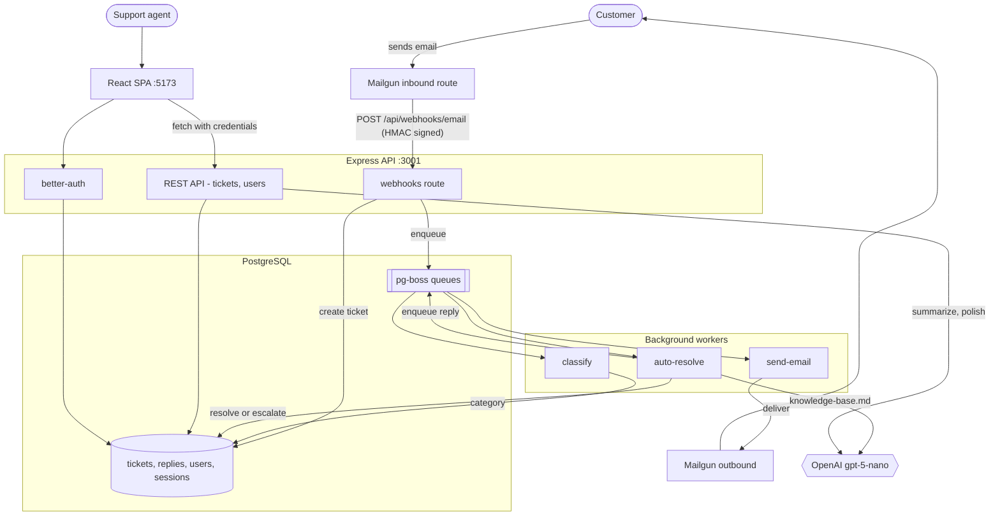
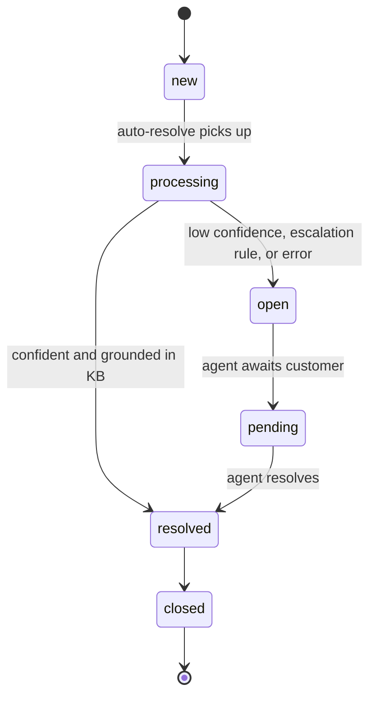

# Helpdesk

AI-powered email ticket management. Customer emails arrive through a Mailgun inbound route, an LLM classifies each one and auto-answers the questions it can ground in a knowledge base, and anything it isn't confident about is escalated to a human agent with the thread intact.

The goal is not to replace support agents — it's to keep repetitive, already-documented questions off their queue while making sure the ambiguous, angry, or legally sensitive messages always reach a person.

---

## Live demo

**https://helpdesk-production-d081.up.railway.app**

### Demo credentials

| Email | Password | Role |
|---|---|---|
| `agent@example.com` | `password123` | `agent` |

This is deliberately the **restricted** role, not the admin one. An `agent` can read tickets, reply, reassign, change status, and use the AI features. It **cannot** access `/users` — creating, editing, and deleting users is admin-only, and `AdminLayout` redirects non-admins away from that route.

> [!WARNING]
> `agent` is the most restricted role that currently exists, but it is not read-only. A demo user can still send real outbound email through the configured Mailgun domain and spend OpenAI credits via the summarize/polish endpoints. See [Known limitations](#known-limitations) before leaving these credentials public.

---

## Screenshots

**Dashboard** — queue stats, AI resolution rate, and 30-day volume



**Tickets** — search, filter by status and category, sort, paginate



**Ticket detail** — the AI's knowledge-base answer, then a human agent's follow-up



<details>
<summary><b>Users</b> — admin-only, and the <b>sign-in</b> screen</summary>





</details>

---

## Features

**Email ingestion**
- Mailgun inbound route posts to `POST /api/webhooks/email`
- Handles both `application/x-www-form-urlencoded` and `multipart/form-data` (Mailgun switches formats when a message carries attachments)
- Prefers `stripped-text` over `body-plain`/`body-html` so quoted thread history doesn't pollute classification
- Deduplicates on RFC `Message-Id`, so Mailgun's delivery retries can't create duplicate tickets

**AI triage**
- **Classify worker** tags each ticket `billing` / `technical` / `account` / `general`
- **Auto-resolve worker** answers only from `knowledge-base.md`, and must clear a `0.85` confidence bar before it will reply
- Hard-coded escalation rules: legal threats, chargebacks, refunds outside the 30-day window, and account-security issues are never auto-answered
- On escalation the ticket flips back to `open` and unassigns, landing it in the human queue

**Agent workspace**
- Dashboard with total/open counts, AI resolution rate, average resolution time, and a 30-day volume chart
- Ticket list with case-insensitive search across subject, sender name, and sender email, plus status and category filters, sortable columns, and pagination
- **Summarize** — condenses a long thread into 2–4 sentences
- **Polish** — rewrites a rough draft reply into a professional response, auto-signed with the agent's name
- Agent replies are queued and delivered as real email via Mailgun

**Access control**
- Session auth via better-auth; self-service sign-up is disabled, users are created by an admin or the seed script
- Two roles: `admin` and `agent`, enforced on both the API (`requireAuth` + `requireAdmin`) and the router (`ProtectedLayout` / `AdminLayout`)

---

## Architecture



**Ticket lifecycle**



The queue is **pg-boss backed by Postgres**, not Redis. `ioredis` and `bullmq` are still in `package.json` and `backend/src/lib/redis.ts` exists, but nothing imports them — the production deployment runs without a Redis service at all.

---

## Tech stack

| Layer | Choice |
|---|---|
| Runtime | Bun |
| API | Express 5, TypeScript |
| Database | PostgreSQL 16, Prisma 7 (`pgvector` extension enabled) |
| Queue | pg-boss 12 (Postgres-backed) |
| Auth | better-auth 1.6 (email + password, `customSession` plugin for roles) |
| AI | Vercel AI SDK 4 + `@ai-sdk/openai`, model `gpt-5-nano` |
| Email | Mailgun (`mailgun.js`) — inbound routes and outbound sends |
| Frontend | React 19, Vite 6, React Router 7, TanStack Query 5, TanStack Table 8 |
| UI | Tailwind CSS 4, shadcn/ui (`base-nova`), Recharts, Lucide |
| Forms | react-hook-form + Zod (schemas shared with the backend via `@helpdesk/core`) |
| Testing | Vitest + React Testing Library (unit/component), Playwright (e2e) |
| Monitoring | Sentry, Pino |
| Hosting | Railway (single service, backend serves the built SPA) |

### Monorepo layout

```
helpdesk/
├── core/       @helpdesk/core — Zod schemas + enums shared by backend and frontend
├── backend/    Express API, Prisma schema, workers (port 3001)
├── frontend/   React SPA (port 5173)
├── e2e/        Playwright tests
└── docker-compose.yml   postgres :5432 · postgres_test :5434 · redis :6379
```

`core` has no build step — Bun and Vite both resolve its TypeScript source directly through the `exports` field. Any schema used for both API validation and form validation lives there, so a request body and the form that produces it are validated by the same object.

---

## Local setup

**Prerequisites:** [Bun](https://bun.sh) (developed against 1.3), Docker, and an OpenAI API key.

```bash
# 1. Clone and install
git clone https://github.com/Abinashi7/helpdesk.git
cd helpdesk
bun install

# 2. Start Postgres + Redis
docker compose up -d

# 3. Configure environment
cp .env.example .env
# Generate the auth secret — startup fails on the placeholder value:
openssl rand -base64 32     # paste into BETTER_AUTH_SECRET
# Set OPENAI_API_KEY and SEED_ADMIN_PASSWORD too.

# 4. Set up the database
cd backend
npx prisma generate
npx prisma migrate deploy
bun run db:seed              # creates admin, agent, and the AI author account

# 5. Run it (two terminals)
cd backend  && bun run dev   # http://localhost:3001
cd frontend && bun run dev   # http://localhost:5173
```

Sign in at `http://localhost:5173/login` with `SEED_ADMIN_EMAIL` / `SEED_ADMIN_PASSWORD`, or with the seeded `agent@example.com` / `password123`.

### Loading sample tickets

`backend/scripts/seed-tickets.ts` contains 93 realistic tickets, but **it does not currently run** — it imports `../generated/prisma/index.js` and constructs `new PrismaClient()` with no arguments, neither of which matches the Prisma 7 client this project generates. To use it, change the import to `../generated/prisma/client.js` and pass the pg adapter the way `backend/prisma/seed.ts` does. `seed-replies-102.ts` has the same problem plus a hardcoded ticket ID and author ID that won't exist in a fresh database.

### Testing

```bash
cd frontend && bun run test      # Vitest component tests
cd frontend && bun run test:ui   # interactive runner

bun run test:e2e                 # Playwright, from the repo root
```

Component tests are the default; e2e is reserved for auth guards, DB round-trips, and multi-page flows. The e2e suite uses a separate database on port `5434` — start it with `docker compose up -d` and seed it via `bun run db:seed:test`.

### Receiving real email locally

Point a Mailgun route at your tunnel (`ngrok http 3001`) with the **Store and notify** action targeting `https://<tunnel>/api/webhooks/email`. Locally you can skip Mailgun signing and use the shared secret instead:

```bash
curl -X POST http://localhost:3001/api/webhooks/email \
  -H "x-webhook-secret: $WEBHOOK_SECRET" \
  -d "from=Jane Doe <jane@example.com>" \
  -d "subject=I can't access my course" \
  -d "stripped-text=I bought the Node course but it isn't in my dashboard."
```

---

## Environment variables

Copy `.env.example` to `.env`. The backend loads it via `--env-file ../.env` and validates it with Zod at startup — **any variable in the schema that is missing or malformed exits the process immediately** rather than failing later at runtime. One important exception is called out below the tables.

### Required

| Variable | Notes |
|---|---|
| `DATABASE_URL` | PostgreSQL connection string. Also backs the pg-boss job queues. |
| `BETTER_AUTH_SECRET` | Signs session tokens. Minimum 32 chars; the literal placeholder from `.env.example` is rejected. Generate with `openssl rand -base64 32`. |
| `OPENAI_API_KEY` | Used by the classify worker, auto-resolve worker, and the summarize/polish endpoints. See the caveat below. |

### Auth and app

| Variable | Default | Notes |
|---|---|---|
| `BETTER_AUTH_URL` | `http://localhost:3001` | Public URL of the API. |
| `FRONTEND_URL` | `http://localhost:5173` | CORS origin; must match exactly, credentials are enabled. |
| `PORT` | `3001` | Injected automatically on Railway — don't set it there. |
| `NODE_ENV` | `development` | `production` enables auth rate limiting and static SPA serving. |
| `SEED_ADMIN_EMAIL` | — | Used by `db:seed`. Also the account the auto-resolve worker attributes AI replies to. |
| `SEED_ADMIN_PASSWORD` | — | Minimum 8 chars. |

### Email (Mailgun)

| Variable | Notes |
|---|---|
| `MAILGUN_API_KEY` | Optional. Unset means `sendEmail()` logs a warning and no-ops, which is usually what you want locally. |
| `MAILGUN_DOMAIN` | Your verified sending domain. |
| `MAILGUN_FROM_EMAIL` | From address on outbound replies. |
| `MAILGUN_API_URL` | Defaults to `https://api.mailgun.net`. EU accounts **must** set `https://api.eu.mailgun.net` — the US endpoint silently 401s against an EU domain. |
| `MAILGUN_SIGNING_KEY` | HTTP webhook signing key (**not** the API key). When set, inbound requests must carry a valid HMAC signature. **Set this in production.** |
| `WEBHOOK_SECRET` | Fallback shared secret, used only when `MAILGUN_SIGNING_KEY` is unset. Sent as `x-webhook-secret` header or `?webhook_secret=`. |

### Optional

| Variable | Notes |
|---|---|
| `REDIS_URL` | Accepted and defaulted, but currently unused — see the architecture note. |
| `SENTRY_DSN` | Enables Sentry error reporting on both backend and frontend. Zod validation errors are filtered out. |
| `SENTRY_ENVIRONMENT` | `production` or `development`. |
| `VITE_API_URL` | Frontend only, set in `frontend/.env`. Defaults to `http://localhost:3001`. |

> [!IMPORTANT]
> `backend/src/config/env.ts` declares `ANTHROPIC_API_KEY` but nothing reads it — it's a leftover from before the migration to OpenAI. Meanwhile `OPENAI_API_KEY`, which the app genuinely requires, is **not** in the Zod schema, because `@ai-sdk/openai` reads it straight from `process.env`. The practical consequence: if you forget `OPENAI_API_KEY`, the server starts cleanly and only the AI features fail, at runtime, in a worker. Adding it to the schema would turn that into a startup error.

---

## Security

Measures currently in place:

- **Sign-up disabled.** `disableSignUp: true` on better-auth; accounts exist only via an admin or the seed script. The seed script uses a separate better-auth instance that is never mounted as a request handler.
- **Layered authorization.** `requireAuth` resolves the session and 401s without one; `requireAdmin` 403s on non-admins. Admin routes always apply both. The frontend guards are convenience only — the API enforces independently.
- **Secret validation at boot.** `BETTER_AUTH_SECRET` must be ≥ 32 chars and must not be the placeholder, so a misconfigured deploy fails loudly instead of running with a guessable signing key.
- **Signed inbound webhooks.** Mailgun payloads are verified with HMAC-SHA256 over `timestamp + token` using `crypto.timingSafeEqual`. Timestamps older than 24h are rejected — a deliberately generous window, since Mailgun retries for hours and replays are already neutralised by `Message-Id` deduplication. In production with neither `MAILGUN_SIGNING_KEY` nor `WEBHOOK_SECRET` set, the endpoint returns 401 rather than accepting anonymous ticket creation.
- **No error leakage.** The error handler logs internally and returns a generic 500; `err.message` is never forwarded to clients.
- **Rate limiting** on `/api/auth/*` — 20 requests per 15 minutes, production only.
- **Standard hardening**: `helmet`, CORS locked to `FRONTEND_URL` with credentials, request bodies capped at 25 MB on the webhook route, and field-length truncation on all inbound email data before it reaches the database.

### Known limitations

**Security**

- **The demo credentials in this README are live.** Anyone who reads them can sign in to the deployed instance, send real email from the configured Mailgun domain, and consume OpenAI credits. There is no read-only role to fall back on — the schema has only `admin` and `agent`. If this repo is public, treat the demo instance as untrusted and don't point it at a domain you care about.
- **`password123` is hardcoded** in `backend/prisma/seed.ts` for the agent account, so it's identical in every environment seeded from it, production included.
- **The AI endpoints are unthrottled.** Rate limiting covers `/api/auth/*` only. `POST /api/tickets/:id/summarize` and `/replies/polish` are authenticated but uncapped, so a single logged-in user can drive unbounded model spend.
- **Any authenticated agent can act on any ticket.** There is no per-ticket ownership check — assignment is advisory, not enforced.
- **Mailgun's free tier caps outbound at 100 emails/day**, which is roughly the expected volume here. Auto-replies and agent replies share that budget, so a burst of tickets can silently exhaust the day's quota.

**Product**

- **Customer replies create new tickets.** `createTicketFromEmail` only deduplicates on `Message-Id`; there is no in-reply-to threading, so a customer answering an auto-reply opens a second ticket instead of continuing the first. Nothing in the app writes a `customer`-type reply — those exist only in seed data.
- **pgvector is enabled but unused.** The extension is declared in the Prisma schema, yet no model has a vector column. The knowledge base is passed to the model as one whole markdown file on every call, with no retrieval or chunking, so it will not scale past a few thousand tokens.

**AI**

- **No human review before send.** When the auto-resolve worker clears its confidence bar, the reply is written to the thread and emailed to the customer immediately. There is no approval queue and no undo.
- **Confidence is self-reported.** The `0.85` threshold is a number the model produces about its own coverage of the knowledge base. It correlates with correctness but does not guarantee it, and it is not calibrated against measured accuracy.
- **Grounding is instructional, not enforced.** The prompt says to answer only from the knowledge base, but nothing verifies the reply against it afterwards. A confident, fluent, wrong answer is possible.
- **The escalation rules are keyword-driven judgement calls** made by the model — legal threats, chargebacks, out-of-window refunds, security issues. Paraphrasing that the model doesn't recognise as one of those categories can slip through.
- **Classification failures are silent.** If the model returns a category outside the enum, the worker logs a warning and moves on, leaving the ticket uncategorised rather than retrying.
- **The shipped knowledge base is for a specific business** (an online course platform), and the auto-resolve prompt hardcodes "Code with Mosh" in its system prompt and reply signature. Both need editing before this is useful for anything else.
- **`gpt-5-nano` is the smallest model in its family**, chosen for cost. Quality on ambiguous or multi-part tickets is meaningfully below what a larger model produces.
